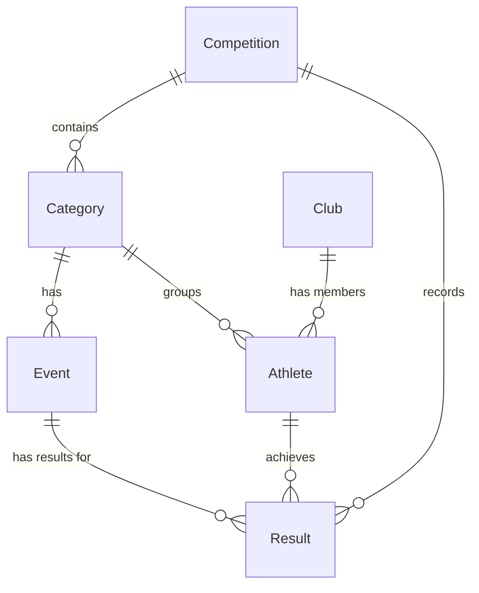

# Entity Model

This document describes the entity model for the Track and Field Competition Management application.

## Entities Overview

The application consists of the following core entities:

- **Competition**: Represents a track and field competition event
- **Category**: Defines age and gender-based groupings for athletes (e.g., Men U18, Women U20)
- **Event**: Represents specific athletic events (e.g., 100m sprint, long jump, shot put)
- **Club**: Represents athletic clubs that athletes belong to
- **Athlete**: Represents individual athletes participating in competitions
- **Result**: Records the performance results of athletes in specific events

## Entity Relationships

## Entity Descriptions

### Competition
Represents a track and field competition event that can be managed by administrators.

**Primary Key**: `id` (sequence-generated)

**Key Attributes**:
- Name
- Date
- Location
- Status (e.g., planned, ongoing, completed)

### Category
Defines athlete groupings based on gender and age range. Categories determine which events athletes compete in.

**Primary Key**: `id` (sequence-generated)

**Key Attributes**:
- Name (e.g., "Men U18", "Women U20")
- Gender (MALE, FEMALE)
- Year from (starting birth year for eligibility)
- Year to (ending birth year for eligibility)

**Relationships**:
- Belongs to a Competition
- Has multiple Events assigned
- Contains multiple Athletes (auto-assigned based on birth year and gender)

### Event
Represents a specific athletic event within a category (e.g., 100m sprint, long jump).

**Primary Key**: `id` (sequence-generated)

**Key Attributes**:
- Name (e.g., "100m Sprint", "Long Jump")
- Type (e.g., TRACK, FIELD)
- Unit (e.g., seconds, meters, centimeters)

**Relationships**:
- Belongs to a Category
- Has multiple Results

### Club
Represents an athletic club that athletes are affiliated with.

**Primary Key**: `id` (sequence-generated)

**Key Attributes**:
- Name
- Abbreviation
- Location

**Relationships**:
- Has multiple Athletes as members

### Athlete
Represents an individual athlete participating in competitions.

**Primary Key**: `id` (sequence-generated)

**Key Attributes**:
- First name
- Last name
- Birth year
- Gender (MALE, FEMALE)

**Relationships**:
- May belong to a Club (optional)
- Automatically assigned to a Category based on birth year and gender
- Has multiple Results across different Events

### Result
Records the performance result of an athlete in a specific event, including calculated points.

**Primary Key**: `id` (sequence-generated)

**Key Attributes**:
- Performance value (e.g., time in seconds, distance in meters)
- Points (calculated using IAAF ranking formulas)
- Rank (position within category)

**Relationships**:
- Belongs to an Athlete
- Belongs to an Event
- Belongs to a Competition

## Key Design Decisions

1. **Sequence-based Primary Keys**: All entities use database sequences for primary key generation, ensuring unique identifiers across the system.

2. **Category Auto-assignment**: Athletes are automatically assigned to categories based on their birth year and gender, ensuring consistent categorization.

3. **Points Calculation**: Points are stored in the Result entity after calculation using IAAF formulas, allowing for efficient ranking queries.

4. **Competition-scoped Results**: Results are linked to both the Competition and Event, enabling tracking of athlete performance across multiple competitions.

5. **Optional Club Membership**: Athletes may participate without club affiliation, making the relationship optional.

## Ranking Logic

The ranking system works as follows:

1. After all Results for a Competition are recorded, points are calculated for each Result using IAAF ranking formulas
2. Athletes are ranked within their Category based on total points across all Events
3. The ranking list displays Athletes grouped by Category, showing individual Event results and total points
