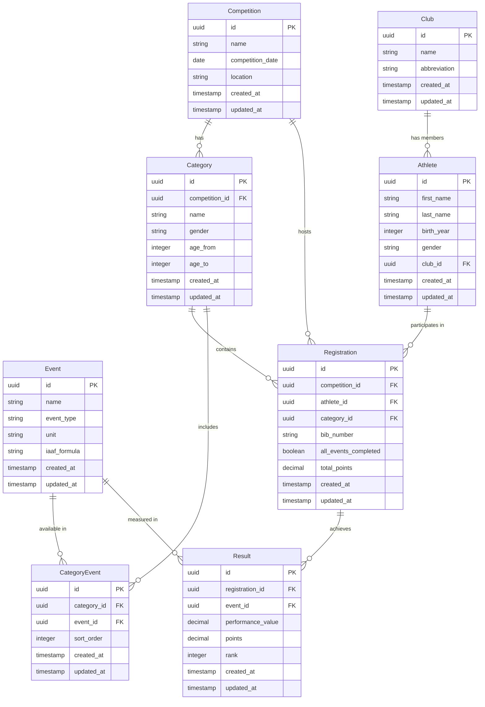

# Entity Model

## Overview

This document describes the entity model for the Track and Field Competition Management System. The model is designed to
support the functional requirements for managing competitions, athletes, categories, events, and results with automatic
IAAF points calculation.

## Entity Relationship Diagram

```mermaid
erDiagram
    Competition {
        uuid id PK
        string name
        date competition_date
        string location
        timestamp created_at
        timestamp updated_at
    }

    Club {
        uuid id PK
        string name
        string abbreviation
        timestamp created_at
        timestamp updated_at
    }

    Athlete {
        uuid id PK
        string first_name
        string last_name
        integer birth_year
        string gender
        uuid club_id FK
        timestamp created_at
        timestamp updated_at
    }

    Category {
        uuid id PK
        uuid competition_id FK
        string name
        string gender
        integer age_from
        integer age_to
        timestamp created_at
        timestamp updated_at
    }

    Event {
        uuid id PK
        string name
        string event_type
        string unit
        string iaaf_formula
        timestamp created_at
        timestamp updated_at
    }

    CategoryEvent {
        uuid id PK
        uuid category_id FK
        uuid event_id FK
        integer sort_order
        timestamp created_at
        timestamp updated_at
    }

    Registration {
        uuid id PK
        uuid competition_id FK
        uuid athlete_id FK
        uuid category_id FK
        string bib_number
        boolean all_events_completed
        decimal total_points
        timestamp created_at
        timestamp updated_at
    }

    Result {
        uuid id PK
        uuid registration_id FK
        uuid event_id FK
        decimal performance_value
        decimal points
        integer rank
        timestamp created_at
        timestamp updated_at
    }

    Competition ||--o{ Category: "has"
    Competition ||--o{ Registration: "hosts"
    Club ||--o{ Athlete: "has members"
    Athlete ||--o{ Registration: "participates in"
    Category ||--o{ Registration: "contains"
    Category ||--o{ CategoryEvent: "includes"
    Event ||--o{ CategoryEvent: "available in"
    Event ||--o{ Result: "measured in"
    Registration ||--o{ Result: "achieves"
```

## Entity Descriptions

### Competition

Represents a track and field competition event.

- **id**: Unique identifier (UUID)
- **name**: Competition name
- **competition_date**: Date of the competition
- **location**: Venue or location of the competition
- **created_at**: Timestamp of record creation
- **updated_at**: Timestamp of last update

### Club

Represents a sports club or organization.

- **id**: Unique identifier (UUID)
- **name**: Full name of the club
- **abbreviation**: Short code for the club (e.g., "LAC", "TSV")
- **created_at**: Timestamp of record creation
- **updated_at**: Timestamp of last update

### Athlete

Represents an individual athlete.

- **id**: Unique identifier (UUID)
- **first_name**: Athlete's first name
- **last_name**: Athlete's last name
- **birth_year**: Year of birth (used for category assignment)
- **gender**: Gender (M/F/Other) for category assignment
- **club_id**: Reference to the athlete's club (nullable for unaffiliated athletes)
- **created_at**: Timestamp of record creation
- **updated_at**: Timestamp of last update

### Category

Represents a competition category based on age and gender.

- **id**: Unique identifier (UUID)
- **competition_id**: Reference to the competition
- **name**: Category name (e.g., "U20 Men", "Senior Women")
- **gender**: Gender for this category
- **age_from**: Minimum age (inclusive)
- **age_to**: Maximum age (inclusive)
- **created_at**: Timestamp of record creation
- **updated_at**: Timestamp of last update

### Event

Represents a track and field event (e.g., 100m, Long Jump).

- **id**: Unique identifier (UUID)
- **name**: Event name
- **event_type**: Type of event (track/field/throwing)
- **unit**: Measurement unit (seconds/meters/points)
- **iaaf_formula**: Reference to the IAAF scoring formula
- **created_at**: Timestamp of record creation
- **updated_at**: Timestamp of last update

### CategoryEvent

Junction table linking categories to available events.

- **id**: Unique identifier (UUID)
- **category_id**: Reference to the category
- **event_id**: Reference to the event
- **sort_order**: Display order for the event within the category
- **created_at**: Timestamp of record creation
- **updated_at**: Timestamp of last update

### Registration

Represents an athlete's registration for a competition.

- **id**: Unique identifier (UUID)
- **competition_id**: Reference to the competition
- **athlete_id**: Reference to the athlete
- **category_id**: Reference to the assigned category
- **bib_number**: Competition bib/start number
- **all_events_completed**: Flag indicating if athlete completed all events
- **total_points**: Calculated total IAAF points (cached for performance)
- **created_at**: Timestamp of record creation
- **updated_at**: Timestamp of last update

### Result

Represents an athlete's result in a specific event.

- **id**: Unique identifier (UUID)
- **registration_id**: Reference to the athlete's registration
- **event_id**: Reference to the event
- **performance_value**: The raw result (time/distance/height)
- **points**: Calculated IAAF points for this result
- **rank**: Position within the category for this event
- **created_at**: Timestamp of record creation
- **updated_at**: Timestamp of last update

## Key Design Decisions

1. **UUID Primary Keys**: All entities use UUIDs as primary keys for better distributed system compatibility and to
   avoid sequence conflicts.

2. **Category Assignment**: Categories are defined per competition with age ranges and gender. Athletes are
   automatically assigned based on their birth year and gender.

3. **Registration Entity**: Acts as the central junction between competitions, athletes, and categories, tracking
   participation and overall performance.

4. **Cached Points**: Total points are cached in the Registration entity for performance optimization when displaying
   rankings.

5. **Flexible Event Configuration**: Events can be associated with different categories through the CategoryEvent
   junction table, allowing different event sets for different age groups.

6. **Audit Fields**: All entities include created_at and updated_at timestamps for audit trail purposes.

## Relationships

- **One-to-Many**:
    - Competition → Category (one competition has multiple categories)
    - Competition → Registration (one competition has multiple registrations)
    - Club → Athlete (one club has multiple athletes)
    - Category → Registration (one category contains multiple registrations)
    - Registration → Result (one registration has multiple results)

- **Many-to-Many** (through junction tables):
    - Category ↔ Event (through CategoryEvent)

## Data Integrity Constraints

1. An athlete can only have one registration per competition
2. A registration can only have one result per event
3. Category age ranges should not overlap within the same competition and gender
4. Points are recalculated when all_events_completed flag is set to true
5. Gender values should be validated against a defined set (M/F/Other)